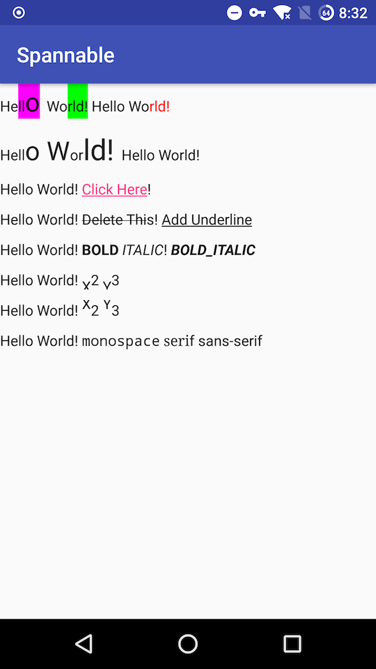

# SpannableTextView
Spannable TextView for android, implements SpannableString in xml layout file.


## Usage

1. Import from jcenter

   ```groovy
   compile 'com.jiakaiyang:spannabletextview:0.9.1'
   ```

   ​

2. Add some Span.

   ```xml
           <com.jiakaiyang.lib.SpannableTextView
               android:id="@+id/spannable"
               android:layout_width="wrap_content"
               android:layout_height="wrap_content"
               android:text="hsdgdhsagdhjsagfdeugf"
               spannable:addAbsoluteSizeSpan="3,4,6,17,25,1"
               spannable:addBackgroundColorSpan="1,8,12,18,#FF00FF00/1,2,5,33,#FFFF00FF"
               spannable:addForegroundColorSpan="2,0,-4,17,#FFFF0000" />
   ```

   The screenshot for this xml layout:

   

3. Remove some Span.

   ```java
   SpannableTextView textView = findViewById(R.id.spannable);
   textView.removeSpan(1);
   ```


### Support Spans

1. BackgroundColorSpan
2. ForegroundColorSpan
3. AbsoluteSizeSpan
4. RelativeSizeSpan
5. StrikethroughSpan
6. UnderlineSpan
7. StyleSpan


### Attrs

#### 1. Attrs for SpannableTextView

While you add some span, the attrs will like:

```xml
   spannable:addBackgroundColorSpan="1,8,12,12,#FF00FF00/1,2,5,12,#FFFF00FF"
```


Multi spans attires is split by "/", the args will be used to create Span instance,

```xml
   spannable:addBackgroundColorSpan="id,start,end,spanFlag,extraData"
```


| Name      | index | Desc                                     |
| :-------- | ----- | :--------------------------------------- |
| id        | 0     | Span id, every Span should has unique id. |
| start     | 1     | the start index for this Span, start will always >= 0. |
| end       | 2     | the end index for this Span, end can < 0, when end is negative, the target will start from the end of the Charsequence. |
| spanFlag  | 3     | flag for Span</br> Spanned.SPAN_EXCLUSIVE_EXCLUSIVE = 33;</br>Spanned.SPAN_EXCLUSIVE_INCLUSIVE = 34;</br>Spanned.SPAN_INCLUSIVE_EXCLUSIVE = 17;</br>Spanned.SPAN_INCLUSIVE_INCLUSIVE = 18; |
| extraData | >= 4  | extra data for specified Span. Such as BackgroundColorSpan will has `backgroundColor` in its extraData. |


#### 2. Extra Data for Every Support Span


### TODO

-[ ] Add other Spans support.

